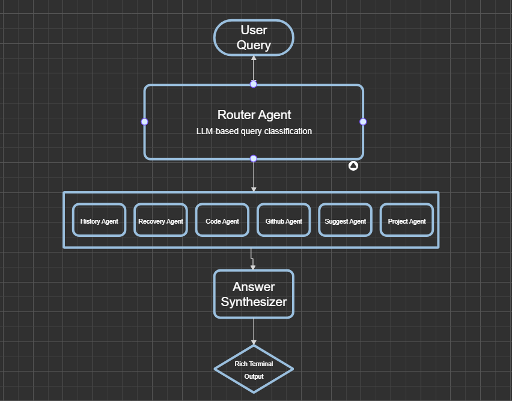
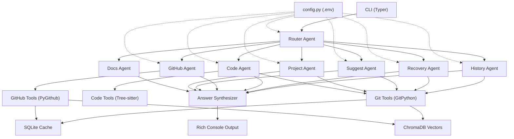

<div align="center">

# GitMind

### Copilot helps you write code. GitMind helps you understand what happened to it.

**Your AI-powered Git companion that reads repository history, analyzes code changes, traces commits to PRs and issues, recovers lost work, and tells the story of your codebase — all from the terminal.**

[](https://python.org)
[](LICENSE)
[](https://github.com/langchain-ai/langgraph)
[](https://ai.google.dev/)

</div>

---

## The Problem

You stare at `git log --oneline` and see a wall of cryptic commit messages. You wonder:

- *"Why was this function introduced?"*
- *"Who broke this last Tuesday?"*
- *"I accidentally ran `git reset --hard` — can I get my work back?"*
- *"What should I push next? Is it safe?"*

Existing tools show you **what** happened. GitMind tells you **why**, **who**, and **what to do next**.

---

## What GitMind Does

GitMind is a **multi-agent CLI tool** that uses AI to deeply understand your Git repository. Instead of parsing raw logs yourself, you ask questions in plain English — and GitMind's specialist agents investigate commits, diffs, PRs, issues, code structure, and reflog to give you real answers.

```
You: "Why was authentication added to this project?"

GitMind:
  → Finds commits touching auth files (History Agent)
  → Analyzes function-level changes (Code Agent)
  → Traces commit → PR #67 → Issue #42 (GitHub Agent)
  → Synthesizes a complete answer
```

---

## Features

### `gitmind story` — Repository Storytelling

Transforms raw commit history into a **human-readable narrative** grouped by feature, phase, and contributor.

```bash
gitmind story --days 14 --detailed
```

> *"This repository began as a CLI tool for Git analysis. During the first week, the core agent architecture was established with LangGraph orchestration. The project then evolved into a multi-agent system with specialized agents for history, recovery, code analysis, and GitHub integration..."*

### `gitmind ask` — Repo-Aware Q&A

Ask anything about your repository in natural language. Supports single-shot and multi-turn chat.

```bash
gitmind ask "what changed in the last 3 days?"
gitmind ask "who introduced the vector store?"
gitmind ask --chat   # interactive mode
```

### `gitmind suggest` — Proactive Advisor

No question needed. GitMind proactively analyzes your repo state and tells you what to do next.

```bash
gitmind suggest
```

```markdown
I noticed:

- 🟡 You have 3 unpushed commits on 'feature/auth'
- 🔴 You rebased 8 minutes ago — remote has diverged
- 🟢 Branch 'old-experiment' hasn't been updated in 45 days

Recommended workflow:
1. Resolve the diverged remote with `git push --force-with-lease`
2. Delete the stale branch with `git branch -d old-experiment`
```

### `gitmind recover` — Lost Work Recovery

Scans reflog, dangling objects, and stashes to find and recover lost commits, deleted branches, and abandoned work.

```bash
gitmind recover
```

> *"Lost commit detected: Hash `abc1234`, removed by `reset --hard` 12 minutes ago. Recovery: `git checkout -b recovery-branch abc1234`. Risk: Safe."*

### `gitmind explain` — Deep Dive

Explain a specific commit, file, or feature by tracing its full context chain.

```bash
gitmind explain abc1234          # explain a commit
gitmind explain src/main.py      # explain a file's evolution
gitmind explain "auth system"    # explain a feature
```

### `gitmind project` — Project Understanding

Analyzes README, docs, package metadata, and repo structure to explain what the project is, its architecture, technologies, and how to get started.

```bash
gitmind project                          # full overview
gitmind project "what does this do?"     # specific question
gitmind project "how do I set this up?"  # setup instructions
```

### `gitmind index` — Semantic Search Setup

Embeds commit messages, PR descriptions, and issue descriptions into ChromaDB for semantic search across your repository's history.

```bash
gitmind index --days 90
```

---

## Architecture

GitMind uses a **multi-agent architecture** powered by LangGraph. Each query is routed to the right specialist agent(s), and their outputs are synthesized into a single coherent response.



### Agent Responsibilities

| Agent | Role | Tools Used |
|-------|------|------------|
| **History** | Commit archaeology, feature evolution, repo storytelling | `git log`, `git show`, `git blame`, embeddings search |
| **Recovery** | Lost commit detection, deleted branch recovery, reflog analysis | `git reflog`, `git fsck`, stash inspection |
| **Code** | Function-level change tracking, AST analysis, dependency mapping | Tree-sitter (Python, JS, TS), `git diff` |
| **GitHub** | PR/issue/review context, commit → PR → issue tracing | PyGithub API |
| **Suggest** | Proactive repo state analysis, safety checks, next-step recommendations | Status, reflog, unpushed detection, force-push risk |
| **Project** | High-level project understanding from docs, metadata, and structure | README, pyproject.toml, docs/, package.json |
| **Docs** | Git command documentation, concept explanations, workflow guidance | Built-in git knowledge base |

### Data Flow

> NOTE: Even I don't fully understand this diagram (now, it's too messy), but it works.



---

## Installation

### Prerequisites

- **Python 3.10+**
- **Git** installed and available in PATH
- An **API key** for Google Gemini (default) or OpenAI

### Quick Start

```bash
# 1. Clone the repository
git clone https://github.com/vastavikadi/GitMind.git
cd GitMind

# 2. Create and activate a virtual environment
python -m venv venv

# On Windows
venv\Scripts\activate

# On macOS/Linux
source venv/bin/activate

# 3. Install in development mode
pip install -e .

# 4. Set up configuration
cp config.sample.py config.py
cp .env.example .env
```

### Configuration

Edit your `.env` file with your API keys:

```env
# Required — choose your LLM provider
LLM_PROVIDER=gemini
GEMINI_API_KEY=your-gemini-api-key

# Optional — only if using OpenAI
# LLM_PROVIDER=openai
# OPENAI_API_KEY=your-openai-api-key

# Optional — enables GitHub agent (PR/issue context)
# Create at: https://github.com/settings/tokens (classic token with repo + read:org)
GITHUB_TOKEN=your-github-token

# Optional — enables LangSmith tracing for debugging
# LANGSMITH_TRACING=true
# LANGSMITH_API_KEY=your-langsmith-api-key
```

> **Note:** GitMind has been primarily tested with **Google Gemini**. OpenAI is supported but not as extensively tested.

### Verify Installation

```bash
gitmind --help
```

---

## Usage

Navigate to **any Git repository** and run GitMind commands:

```bash
cd /path/to/your/repo

# Tell the story of last 7 days
gitmind story

# Ask a question
gitmind ask "why was this module refactored?"

# Get proactive suggestions
gitmind suggest

# Recover lost work
gitmind recover

# Explain a commit
gitmind explain abc1234

# Understand the project
gitmind project

# Build the semantic search index (run once)
gitmind index
```

### Command Reference

| Command | Description | Key Flags |
|---------|-------------|-----------|
| `gitmind story` | Narrative of repo history | `--days N`, `--detailed`, `--no-ai`, `--quickoverview` |
| `gitmind ask` | Repo-aware Q&A | `"question"`, `--chat` for interactive mode |
| `gitmind suggest` | Proactive suggestions | — |
| `gitmind recover` | Reflog analysis + recovery | — |
| `gitmind explain` | Explain commit/file/feature | `<target>` (hash, path, or name) |
| `gitmind project` | Project overview | `"optional question"` |
| `gitmind index` | Build vector search index | `--days N` |

---

## Tech Stack

| Layer | Technology | Purpose |
|-------|-----------|---------|
| **CLI** | [Typer](https://typer.tiangolo.com/) + [Rich](https://rich.readthedocs.io/) | Terminal interface with styled panels, tables, spinners |
| **Agent Orchestration** | [LangGraph](https://github.com/langchain-ai/langgraph) | Multi-agent workflow with routing and synthesis |
| **LLM** | [Gemini](https://ai.google.dev/) / [OpenAI](https://openai.com/) | Reasoning, analysis, and natural language generation |
| **Git Analysis** | [GitPython](https://gitpython.readthedocs.io/) | Commit history, reflog, blame, branches, diffs |
| **Code Analysis** | [Tree-sitter](https://tree-sitter.github.io/) | AST parsing for Python, JavaScript, TypeScript |
| **GitHub Integration** | [PyGithub](https://pygithub.readthedocs.io/) | PRs, issues, reviews, commit → PR tracing |
| **Embeddings** | [ChromaDB](https://www.trychroma.com/) + LangChain | Semantic search over commits, PRs, issues |
| **Structured Data** | SQLite + [Pydantic](https://docs.pydantic.dev/) | Cached repo data with validated models |
| **Observability** | [LangSmith](https://smith.langchain.com/) | Agent tracing, debugging, and evaluation |

---

## Project Structure

```
gitmind/
├── agents/                   # Specialist AI agents
│   ├── history/              # Commit archaeology & storytelling
│   ├── recovery/             # Lost work recovery
│   ├── code/                 # AST-based code analysis
│   ├── github/               # PR/issue/review context
│   ├── suggest/              # Proactive repo advisor
│   ├── project/              # Project understanding
│   └── docs/                 # Git documentation helper
├── tools/                    # LangChain tools for agents
│   ├── git_tools.py          # 19 git inspection tools
│   ├── code_tools.py         # Tree-sitter AST analysis tools
│   └── story/                # Non-AI story generator
├── workflows/                # Orchestration layer
│   ├── router.py             # Query classification & routing
│   ├── orchestrator.py       # Main pipeline (route → invoke → synthesize)
│   └── synthesizer.py        # Multi-agent output merger
├── github/                   # GitHub API integration
│   ├── github_client.py      # PyGithub wrapper
│   └── github_tools.py       # LangChain tool wrappers
├── embeddings/               # Vector search
│   └── vector_store.py       # ChromaDB + LangChain embeddings
├── data/                     # Data layer
│   ├── database.py           # SQLite cache
│   └── models.py             # Pydantic models
├── utils/                    # Utilities
│   ├── output.py             # Rich formatting helpers
│   └── banner.py             # CLI banner display
├── cli.py                    # Typer CLI (all 7 commands)
├── config.py                 # Central configuration (.env loading)
├── config.sample.py          # Sample configuration (safe to commit)
├── .env.example              # Environment variable template
└── pyproject.toml            # Project metadata & dependencies
```

---

## How It Works — Under the Hood

### 1. Query Routing

When you run `gitmind ask "why was auth added?"`, the **Router Agent** classifies your query using the LLM and determines which specialist agent(s) to invoke:

```
"why was auth added?" → primary: HISTORY, secondary: [CODE, GITHUB]
```

For direct commands like `gitmind suggest`, routing is bypassed entirely — the correct agent is invoked immediately.

### 2. Agent Execution

Each agent follows an **agentic loop** pattern:

1. The LLM receives the query + system prompt + available tools
2. It decides which tools to call (e.g., `get_commit_history`, `get_file_blame`)
3. Tools execute and return results
4. The LLM reasons over the results
5. It either calls more tools or produces a final answer

### 3. Answer Synthesis

If multiple agents contribute, the **Synthesizer** merges their outputs into one coherent response — deduplicating information, resolving conflicts, and preserving specific details like commit hashes and PR numbers.

### 4. Semantic Search

The `gitmind index` command embeds commit messages, PR descriptions, and issue text into **ChromaDB**. Agents can then perform semantic searches like *"find commits related to authentication"* instead of relying on exact keyword matches.

---

## The Origin Story

GitMind started with a simple frustration: **`git log` tells you what happened, but not why.**

The brainstorming process began with four ideas — a Git Coach, AI Git Autocomplete, Git History Explainer, and AI Reflog Recovery Assistant — and converged into one unified tool that does all of them.

The original vision:

> *"The agent reads commit history, groups commits by feature, detects force-push risk, and suggests exact commands."*

Every feature in GitMind traces back to a real developer pain point. The brainstorming document that started it all is preserved in [`WTF_I_BRAINSTORMED.md`](WTF_I_BRAINSTORMED.md) — raw, unfiltered, and exactly how the ideas first took shape.

---

## Roadmap

- [ ] **MCP Server** — Expose GitMind tools via Model Context Protocol for use in IDEs and other LLM clients
- [ ] **Context7 Integration** — Live documentation retrieval for git commands and libraries
- [ ] **Multi-turn Memory** — Persistent chat history across sessions
- [ ] **Git Hooks Integration** — Pre-push safety checks powered by the Suggest agent
- [ ] **VS Code Extension** — Bring GitMind into the editor
- [ ] **Multi-repo Support** — Analyze relationships across multiple repositories
- [ ] **Custom Agent Plugins** — Let users define their own specialist agents

---

## Contributing

Contributions are welcome. If you'd like to contribute:

1. Fork the repository
2. Create a feature branch (`git checkout -b feature/your-feature`)
3. Make your changes
4. Run the tool against a test repository to verify
5. Submit a Pull Request

---

## License

This project is licensed under the **MIT License**. See [LICENSE](LICENSE) for details.

---

## Author

**Aditya Shukla**

- GitHub: [@vastavikadi](https://github.com/vastavikadi)
- Email: adityashukla.sm26@gmail.com

---

<div align="center">

*GitMind — Because your repository has a story. Let AI tell it.*

</div>
